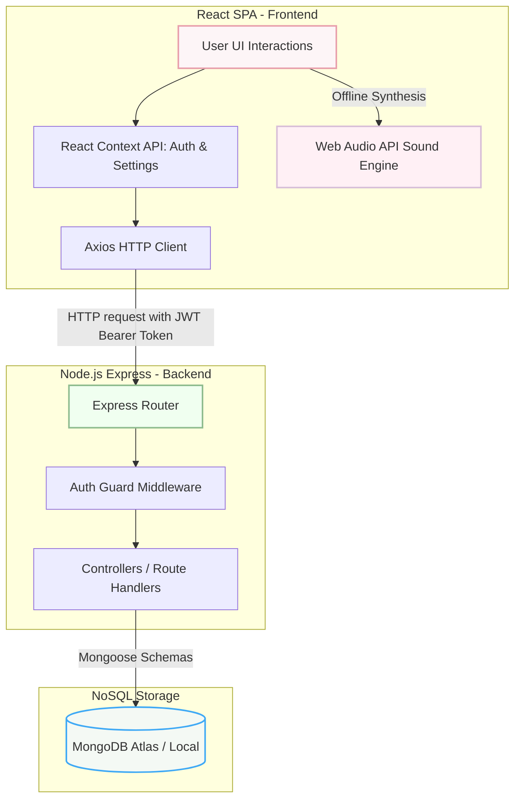

# 🌸 Serenity Journal

A calming, responsive daily journal for emotional wellbeing. Users can write diary entries, track their moods, perform breathing exercises, set meditation timers, manage daily goals, list gratitude logs, and listen to relaxing ambient tracks. 

This project is built using a modern **MERN stack (MongoDB, Express, React, Node)** with a soft, Japanese-inspired interface focusing on smooth animations, dynamic themes, and a secure offline-first user experience.

---

## 🗺️ Architectural Workflow

The application operates as a decoupled single-page application (SPA) communicating with a RESTful API backend, utilizing a secure JWT authentication flow and local browser-based audio synthesis.



### Key Subsystem Workflows:

1.  **Authentication & Sessions**:
    *   **Registration/Login**: User credentials are submitted to the backend. Passwords and security recovery answers are hashed using `bcryptjs` before being stored.
    *   **Token Generation**: On success, the server signs a JSON Web Token (JWT) valid for 30 days.
    *   **Authorization Interceptor**: The React frontend stores the JWT in `localStorage` (`sj_token`). A global [Axios interceptor](file:///c:/Users/DELL/Downloads/serenity-journal/serenity-journal/frontend/src/utils/api.js) automatically attaches this token in the `Authorization: Bearer` header of every subsequent API request.
2.  **Journal Writing & Streak Mechanics**:
    *   Writing acts are autosaved. When saved, the server dynamically calculates writing streaks by checking the difference between the current date and the user's `lastEntryDate`. If it is exactly the next calendar day, the streak increments; if they missed a day, it resets.
3.  **Local Audio Synthesis**:
    *   To keep the codebase license-compliant and lightweight, the custom [soundEngine.js](file:///c:/Users/DELL/Downloads/serenity-journal/serenity-journal/frontend/src/utils/soundEngine.js) generates white/pink noise, low-frequency oscillators (LFOs), and piano-pad filters dynamically using the HTML5 **Web Audio API**. This allows high-quality ambient sounds (rain, ocean, forest) to play completely offline without fetching heavy `.mp3` files.

---

## 🧱 Tech Stack Breakdown

| Layer | Technology | Purpose |
| :--- | :--- | :--- |
| **Frontend UI** | **React (Vite)** | Reactive UI framework providing fast render times and optimized production bundles. |
| **Styling** | **Tailwind CSS + CSS Variables** | Utility-first styling tied with design tokens for supporting 9 user themes (Sakura, Forest, Sunset, etc.) and responsive grids. |
| **Animations** | **Framer Motion** | Controls micro-animations, theme cross-fades, calming page transitions, and the breathing exercise guides. |
| **Analytics** | **Chart.js** | Renders emotional patterns, weekly/monthly streaks, and mood distribution ratios. |
| **Server Runtime**| **Node.js (Express)** | Fast, lightweight backend routing and execution engine. |
| **Database** | **MongoDB (Mongoose)** | Document database. Mongoose models map JavaScript schemas to collections dynamically. |
| **Security** | **JWT + BcryptJS** | Token-based auth guard and secure cryptographic password hashing. |

---

## 📁 Project Directory Hierarchy

```
serenity-journal/
├── backend/
│   ├── config/          # DB connection options (db.js)
│   ├── controllers/     # Route business logic (auth, journals, settings, todos, gratitude)
│   ├── models/          # Mongoose database schemas (User, Journal, Settings, Todo, Gratitude)
│   ├── middleware/      # JWT verifiers & global error handling
│   ├── routes/          # API route definitions
│   ├── utils/           # Utility helpers (streaks calculation, JWT signing)
│   ├── data/            # Local fallback files (quotes, affirmations JSON)
│   └── server.js        # Main Express API server entry point
├── frontend/
│   ├── public/          # Static assets
│   ├── src/
│   │   ├── components/  # Reusable widgets (AnimatedBackground, Sidebar, MusicPlayer, Enso)
│   │   ├── context/     # Global React Contexts (AuthContext, SettingsContext)
│   │   ├── pages/       # Router Pages (Dashboard, JournalEditor, Breathing, Meditation, Analytics)
│   │   ├── data/        # Definitions of active themes and emotions
│   │   ├── utils/       # Global API axios configuration & local sound engine
│   │   ├── App.jsx      # Navigation routing tree
│   │   └── main.jsx     # Frontend entry point
│   ├── tailwind.config.js # Styling overrides & theme mappings
│   └── index.html       # HTML entry template
```

---

## ⚙️ Local Development Setup

To run the application locally on your computer:

### 1. Prerequisites
*   **Node.js**: Version 18 or newer.
*   **MongoDB**: An active local MongoDB Server (`mongod`) OR a free cloud cluster URL from [MongoDB Atlas](https://www.mongodb.com/cloud/atlas).

### 2. Configure Environment Variables
Create a `.env` configuration file in both directories:

*   **Backend config** in [backend/.env](file:///c:/Users/DELL/Downloads/serenity-journal/serenity-journal/backend/.env):
    ```ini
    PORT=5000
    MONGO_URI=mongodb://127.0.0.1:27017/serenity-journal   # Or MongoDB Atlas link
    JWT_SECRET=your_long_random_secure_secret_string
    JWT_EXPIRES_IN=30d
    CLIENT_URL=http://localhost:5173
    ```
*   **Frontend config** in [frontend/.env](file:///c:/Users/DELL/Downloads/serenity-journal/serenity-journal/frontend/.env):
    ```ini
    VITE_API_URL=http://localhost:5000/api
    ```

### 3. Execution Commands
Open **two terminals** to run the services concurrently:

*   **Backend Server**:
    ```bash
    cd backend
    npm install
    npm run dev       # Starts nodemon at http://localhost:5000
    ```
*   **Frontend Client**:
    ```bash
    cd frontend
    npm install
    npm run dev       # Starts Vite dev server at http://localhost:5173
    ```
    *(Note: If Windows PowerShell blocks scripts, run commands with `npm.cmd` instead of `npm`)*

---

## 🚀 Production Deployment

### 1. Deployed Backend (Render)
*   **Root Directory**: `serenity-journal/backend`
*   **Build Command**: `npm install`
*   **Start Command**: `npm start`
*   **Environment Variables**: Ensure `MONGO_URI`, `JWT_SECRET`, `JWT_EXPIRES_IN`, `NODE_ENV=production`, and `CLIENT_URL` (your frontend domain) are configured.

### 2. Deployed Frontend (Vercel)
*   **Root Directory**: `serenity-journal/frontend`
*   **Framework Preset**: `Vite`
*   **Environment Variables**: Configure `VITE_API_URL` pointing to your deployed backend URL ending in `/api` (e.g., `https://your-api.onrender.com/api`).
